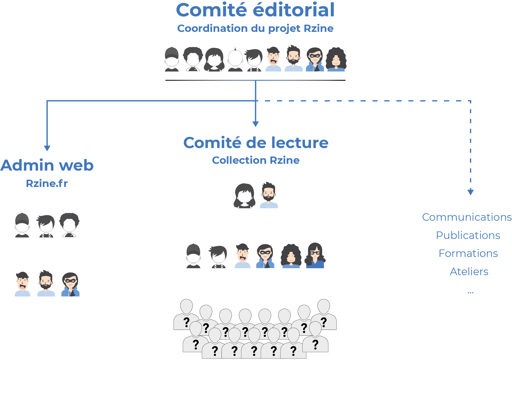
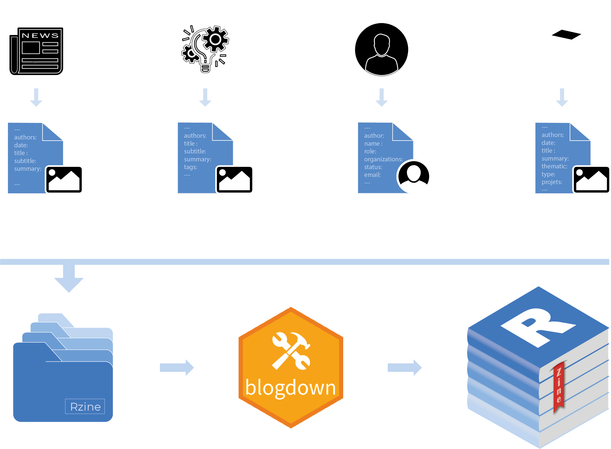
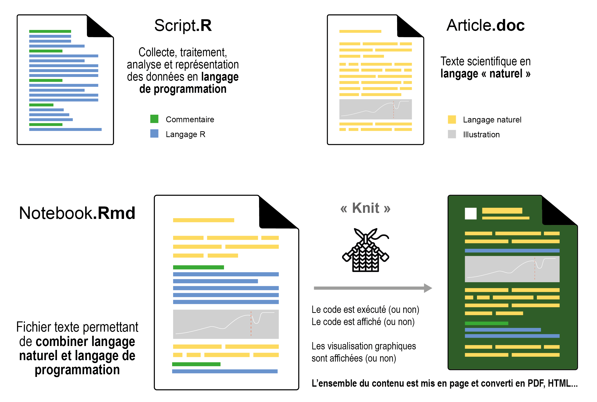
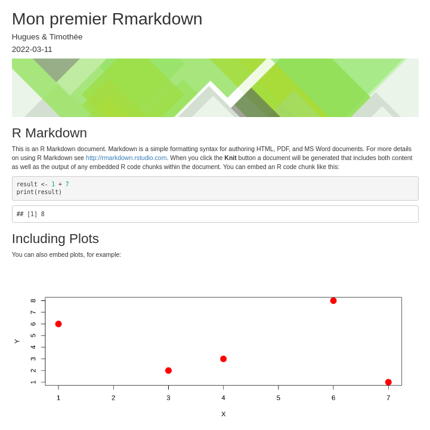

# {data-background="figure/genese.png" data-background-size="400px"}


<h2>**Genèse du projet**</h2>

<br>
<br>
<br>
<br>
<br>
<br>
<br>
<br><span style="color:#4178bc;">
<br>
<br>


## Projet exploratoire de la FR CIST

<p class="smallpcenter" style="margin-top:50px;">Initié par 5 membres de la Fédération de Recherche partageant<br>une envie commune : **produire sur de la documentation sur R**.</p> 


<p class="fragment" style="font-size:80%;">**Objectif :** <span style="color:#4178bc;">Contribuer à l'apprentissage et à la pratique de R en SHS, en favorisant le partage, la production et la diffusion de ressources.</span></p>


## Faire le Bilan pour innover

<p class="medpcenter">Communauté d'utilisateur.rice.s et ressources disponibles sur R ?</p>


<div id="left">
<p class="smallpcenter" style="margin-top:0px;">Points forts</p>
<ul class="xpucsmall">
> - Communauté internationale très active
> - Communauté française importante
> - Langage commun à plusieurs disciplines
> - Beaucoup de ressources en libre accès
> - De très bonnes initiatives existent déjà
</ul>


</div>
<div id="right">
<p class="smallpcenter" style="margin-top:0px;">Points d'amélioration</p>
<ul class="xpucsmall">
> - Ressources parsemées et peu visibles
> - Beaucoup des ressources en anglais
> - Cloisonnée par discipline, institutions...
> - Ressources généralistes vs spécialisées
</ul>
</div>


## Émergence de deux axes


</br>

<div id="left">
<p class="moyp3" style="margin-top:0px;">Prendre en compte l'existant...</p>

<p style="margin-top:0px;"><span style="color:#4178bc;">**Rzine.fr**</span></p>
</div>

<div id="right">
<p class="moyp3" style="margin-top:0px;">...Favoriser la production</p>

<p style="margin-top:0px;"><span style="color:#4178bc;">**Collection Rzine**</span></p>
</div>


## Du renfort

<p class="moyp3" style="margin-top:0px;">5 ingénieur·e·s ont rejoint le projet Rzine</p>


## Organisation


## Organisation





## Organisation


# {data-background="figure/rzine_logo_bis.png" data-background-size="300px"}


<h2>**Rzine.fr**</h2>


<br>
<br>
<br>
<br>
<br>
<br>
<br>
<br>

<h3>Valoriser et partager l'existant...</h3>

## Rzine.fr


<div>
<div id="left3">

</div>


<div id="right33" style="margin-top:0px;">
<p style="margin-left:20px;"><span style="color:#4178bc;">Construit avec R :</span></p>
<ul class="pucsmall0">
> - Utilisation du package [blogdown ](https://bookdown.org/yihui/blogdown/)  
> - Site web statique [](https://gohugo.io/) , thème [Academic](https://academic-demo.netlify.app/)
</ul>
</br>

</div>
</div>

</br>

<div id="left3">

</div>

<div id="right33" style="margin-top:00px;">
<p style="margin-left:20px;"><span style="color:#4178bc;">Et libre !</span></p>  
<ul class="pucsmall">
> - Code source partagé sur le [](https://gitlab.huma-num.fr/rzine/site) de [](https://gitlab.huma-num.fr/rzine/site)
> - Code source sous licence [](https://opensource.org/licenses/MIT)  
> - Un nom de domaine qui appartient au 
> - Site hébergé par l'université 
</ul>
</div>

## 4 types de contenu 

<p style="margin-top:30px;margin-bottom:0px;font-size:90%;"> Qui dessinent les contours de la pratique de R en SHS</p> 


<div id="leftbg">


</div>

<div id="rightbg">
<ul style="margin-top:60px;margin-bottom:45px;">
> - Des [actualités](https://rzine.fr/communaute/#posts)   
> - Des [projets](https://rzine.fr/communaute/#projects)   
> - Des [auteur.e.s](https://rzine.fr/communaute/#people)  
> - Des [ressources](https://rzine.fr/publication/)   
</ul>


<p style="text-align:center;">Signalement :</br>contact@rzine.fr</p>


</div>


## + de 300 [ressources](https://rzine.fr/publication/) 


## Site statique et participatif




# {data-background="figure/Rzine.png" data-background-size="300px"}


<h2>**La collection Rzine**</h2>

<br>
<br>
<br>
<br>
<br>
<br>
<br>
<br>

<p class="smallpcenter">« *Partager ses analyses reproductibles dans un périmètre pluridisciplinaire large</br> et dans le cadre d'une publication valorisée* »</p>

## Objectifs


<p class="fragment" style="font-size:85%;margin-top:60px;"><span style="color:#4178bc;">**1.**</span> **Offrir un espace de publication** innovant qui permet à tout·te·s de valoriser, partager et diffuser son code.</p>

<p class="fragment" style="font-size:85%;margin-top:60px;"><span style="color:#4178bc;">**2.**</span> **Contribuer à l'apprentissage de R**.</p>

<p class="fragment" style="font-size:85%;margin-top:60px;"><span style="color:#4178bc;">**3.**</span> **Contribuer à la démocratisation de l'utilisation du notebook**.</p>

<p class="fragment" style="font-size:85%;margin-top:60px;"><span style="color:#4178bc;">**4.**</span> **Contribuer à la montée en compétence** en matière de programmation lettrée, d'utilisation des logiciels décentralisé de versionnage et de reproductibilité.</p>


## Caractèristiques

</br>

<ul class="pucsmall">
> - Collection <span style="color:#4178bc;">**ouverte à tou·te·s**</span>
> - Format de publication <span style="color:#4178bc;">**notebook**</span> (Rmarkdown)
> - Publications <span style="color:#4178bc;">**soumises à comité de lecture**</span>
> - Processus de <span style="color:#4178bc;">**relecture transparent sur GitHub/GitLab**</span>
> - Publications <span style="color:#4178bc;">**open source**</span> (licences MIT & CC BY-SA 4.0)
> - Informations + données nécessaires à la <span style="color:#4178bc;">**reproductibilité**</span> fournies
> - Publications valorisées (dépôt d'un <span style="color:#4178bc;">**DOI**</span>, référencement sur HAL)
</ul>

## Publication Notebook (Rmarkdown)



## Exemple Rmarkdown

<div id="codermd">

<p class="smallpcenter">Fichier Rmarkdown (source) :</p>

```{r, file = 'figure/ex2.Rmd', eval=FALSE}
```
</div>

<div id="codehtml">

<p class="smallpcenter">Fichier HTML (sortie) :</p>


</div>

## Fiche Rzine (= Rmarkdown)


## Fiche Rzine (= Rmarkdown)


## Fiche Rzine

Quatre fiches déjà publiées :

<ul class="xpucsmall">
> - <a href="https://rzine.fr/docs/20211101_ysebaert_grasland_MTA/index.html">Analyse territoriale multiscalaire</a>, *Ronan Ysebaert* et *Claude Grasland*.
> - <a href="https://rzine.fr/docs/20191125_ironcurtain/index.html">Le nouveau rideau de fer : un exemple de carte en 2,5D</a>, *Nicolas Lambert*.
> - <a href="https://rzine.fr/docs/20200526_glecampion_initiation_aux_correlations/index.html">Analyse des corrélations avec easystats</a>, *Grégoire Le Campion*.
- <a href="https://rzine.fr/docs/20200601_mletexier86_explo_spatiotemporel/index.html" target="_blank">Exploration spatio-temporelle d’objets géographiques ponctuels</a>, *Marion Le Texier*.
</ul>


# {data-background="figure/Rzine.png" data-background-size="300px"}


<h2>**Publier une Fiche ?**</h2>

<br>
<br>
<br>
<br>
<br>
<br>
<br>
<br>
<br>


## Documentation


## package Rzine

Un template rmarkdown + doc


## Processus Git

## Contact

Auteur/relecteur et Plus si affinités


## Diapositives libres (CC BY 3.0)


<br>


<p class="moyp">Consultation :</p>

<p class="moyp222">https://hpecout.gitpages.huma-num.fr/Intro_R_Rstudio_FR/</p>


<br>

<p class="moyp">Code source :</p>

<p class="moyp222">https://gitlab.huma-num.fr/hpecout/Intro_R_Rstudio_FR</p>


<br>


