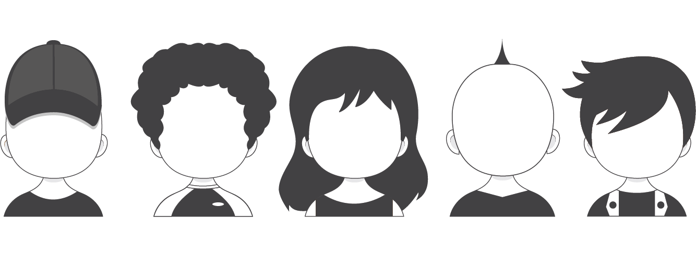

# {data-background="figure/genese.png" data-background-size="400px"}

<h3>**La génése...**</h3>

 
 
 
 
 
 
 
 
 
 

## Les membres fondateurs

 

>- Issues d'unités partenaire de la FR CIST
>- De statuts différents

Mais avec une envie commune : travailler ensemble sur de la documentation sur R

Mais auusi science repo - Programmation lettré...

## Un bilan de l'existant

### Pour ne pas réinventer l'eau chaude

Les points forts

<ul class="xpucsmall">
> - Une communauté très active
> - Déjà beaucoup de documentation
> - Plusieurs initiatives excellentes
> - Un langage interdisciplinaire
> - ... Mais que faire de plus ?
</ul>

Les points faibles

<ul class="xpucsmall">
> - Beaucoup d'anglais
> - Documentation parsemé, peu visible pour un novice
> - Organisé par discipline, institutions, unité...
> - Documentation généraliste vs spécialisée
</ul>

## L'émergence de deux axes de travail 

> - 1) Développement d'un agrégateur qualitatif de contenu

> - 2) Création d'un collection de documentation innovante

# {data-background="figure/rzine_logo_bis.png" data-background-size="300px"}

<h3>**Rzine.fr**</h3>

 
 
 
 
 
 
 
 
 
 

## Collection au format de publication notebook

