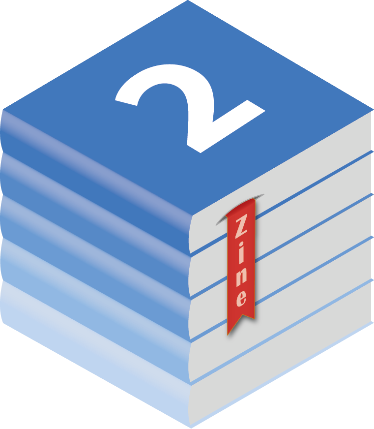
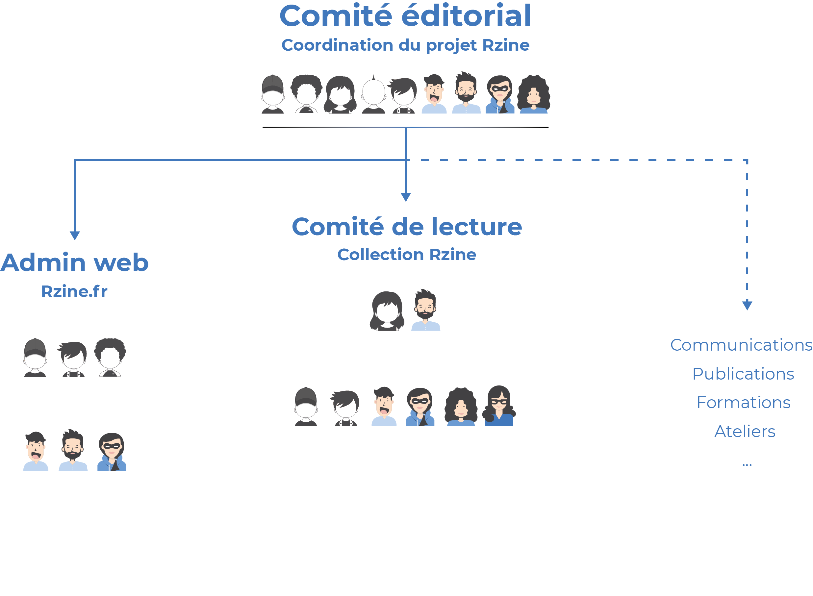

# {data-background="figure/genese.png" data-background-size="400px"}

<h2>**Genèse du projet**</h2>

 
 
 
 
 
 
 
 
 
 
 

## Projet exploratoire de la FR CIST

Initié par 5 membres de la Fédération de Recherche partageant une envie commune : travailler ensemble, sur R !
 

**Objectif :** Contribuer à l'apprentissage et à la pratique de R en SHS, en favorisant le partage, la production et la diffusion de ressources.

## Faire le Bilan pour innover

Communauté d'utilisateur.rice.s et ressources disponibles sur R ?

Points forts

<ul class="xpucsmall">
> - Communauté internationale très active
> - Communauté française importante
> - Langage commun à plusieurs disciplines
> - Énormément de ressources libres
> - Plusieurs bonnes initiatives existent déjà
</ul>

Points d'amélioration

<ul class="xpucsmall">
> - Ressources parsemées et peu visibles
> - Beaucoup des ressources en anglais
> - Cloisonnée par discipline, institutions...
> - Ressources généralistes vs spécialisées
</ul>

## Deux axes de travail

Prendre en compte l'existant...

**Rzine.fr**

...Favoriser la production

**Collection Rzine**

## Du renfort

5 ingénieur·e·s ont rejoint le projet Rzine

## Un fonctionnement en construction

## Un fonctionnement en construction

## Un fonctionnement en construction

# {data-background="figure/rzine_logo_bis.png" data-background-size="300px"}

<h2>**Rzine.fr**</h2>

 
 
 
 
 
 
 
 
 
 

## Un site fait avec R

 

> -  Construit avec le package [blogdown](https://bookdown.org/yihui/blogdown/)
> -  Site web statique [HUGO](https://gohugo.io/), thème [Academic](https://academic-demo.netlify.app/)
> -  Code source mis à disposition sur le [Gitlab Huma-Num]( https://gitlab.huma-num.fr/rzine/site) 
> -  Code source sous licence [MIT](https://opensource.org/licenses/MIT)

 

Un nom de domaine qui appartient au 
 
Un site hébergé par  

## 4 Types de contenu participatifs

## + de 300 ressources !

## Plateforme participative

## Comité éditorial

# {data-background="figure/Rzine.png" data-background-size="300px"}

<h2>**Collection Rzine**</h2>

 
 
 
 
 
 
 
 
 
 

## Valoriser et partager son code

## Ouvert à tou.te.s

## Le format Notebook

## Processus Git

## Comité de lecture 

# {data-background="figure/Rzine.png" data-background-size="300px"}

<h2>**Publier une Fiche ?**</h2>

 
 
 
 
 
 
 
 
 
 

## Documentation et contact

## Les premières fiches 
